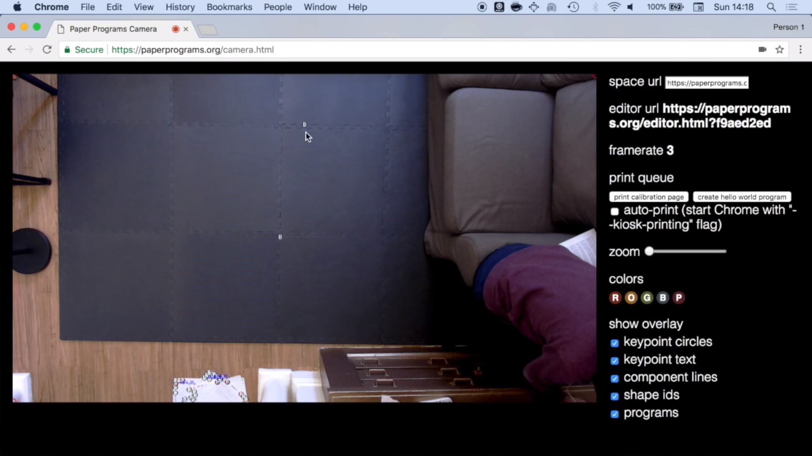
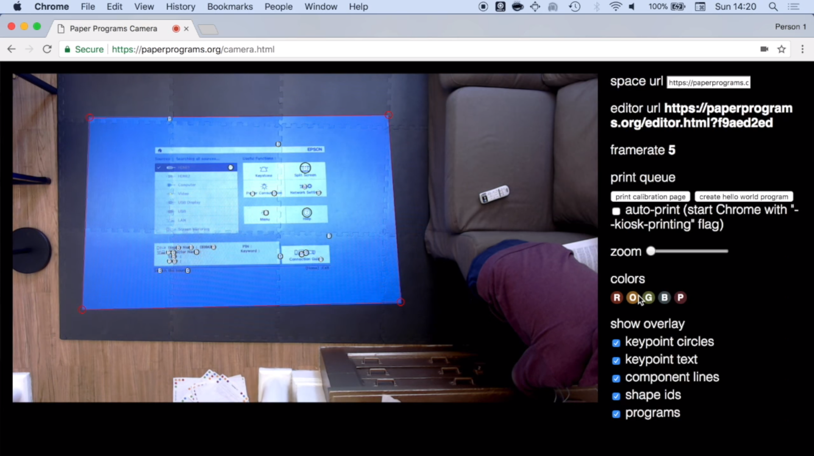
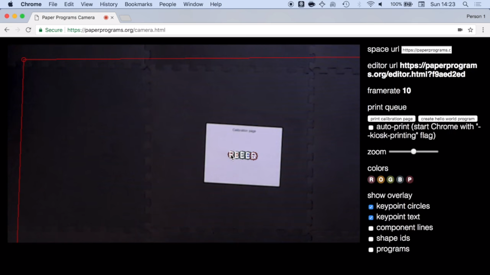
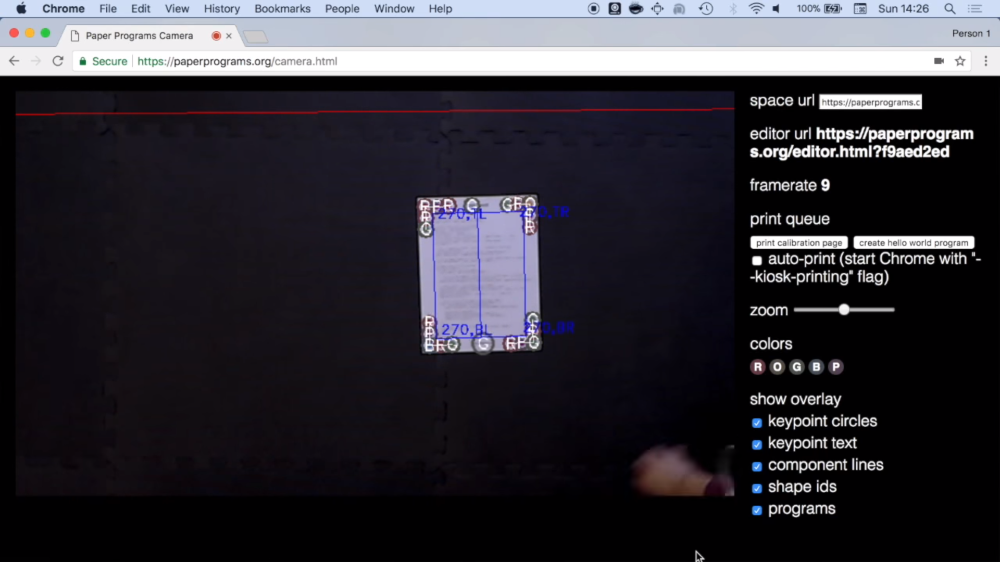
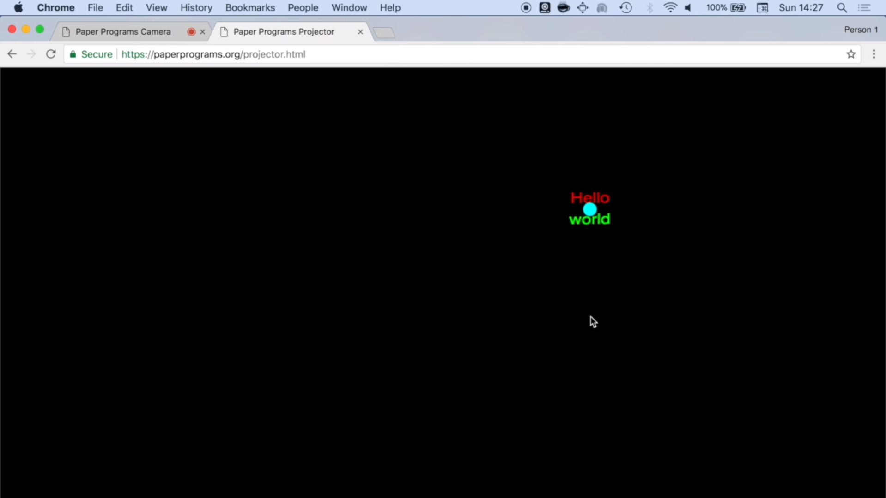
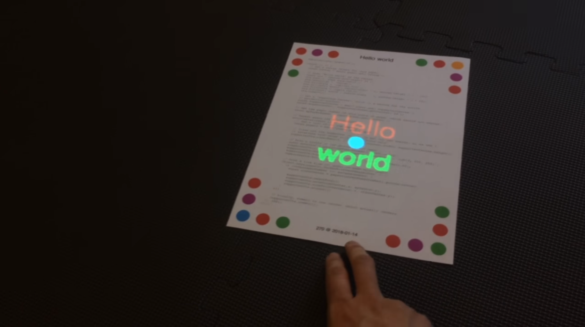
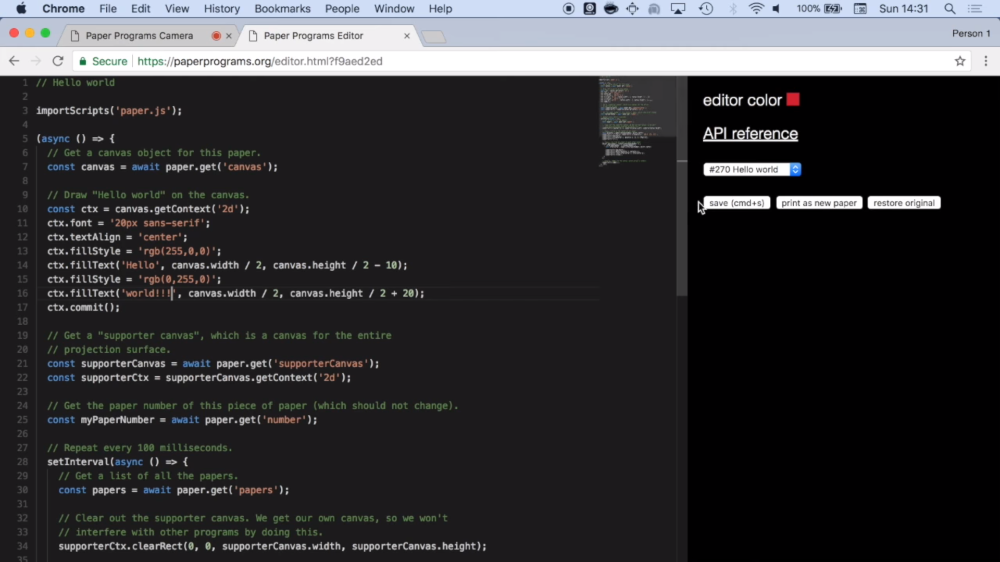

# Getting Started with Paper Programs

This tutorial will cover what you'll need to get a Paper Programs space up and running.

## Hardware Required

- A computer
- A projector - ideally 2000 lumens and 1080p. A 1000 lumens projector can work under some conditions, but the low light needed to see the projections may be too dark for your camera to detect the programs in the space.
- A webcam - 720p works, but be wary that cameras with poor quality sensors may not work well in all lighting conditions.
- A color printer - Any color printer will do.
- A way to mount the projector - This is a tough one, whatever you do, bear in mind that projectors are heavy enough that they need to be connected to something load-bearing like a beam or a stud. Command Strips or screws in drywall will not be enough. (Note that you can project onto a wall and tape your programs to the wall if you just want to try this out, but it's not quite the same).
- Optional: Depending on how you set up your space, you may need unusually long HDMI and USB cables to connect the camera/projector to the computer.
- Optional: A solid black rug or mat to project onto. Bear in mind: a projector's whites can only be as bright as the projector's bulb, and its blacks can only be as black as the surface it is projecting onto.

## Optional: Setting up the server locally

For the rest of this tutorial we'll be using paperprograms.org itself, but if you want to run everything locally here's how to get it all set up:

Make sure to have [Node.js](https://nodejs.org) and [PostgreSQL](https://postgresql.org) installed first. Checkout the repo and run in a terminal:

```sh
npm install
npm run dev
```

This will create a new database, and start all necessary processes. Then go to [localhost:3000](http://localhost:3000) to get started.

If you run into issues, make sure your postgres user is configured correctly, and add their credentials to `knexfile.js` if you run into password issues.

## Setting up the camera

The projector page uses the experimental OffscreenCanvas API, so you'll need to enable `chrome://flags/#enable-experimental-web-platform-features` (this will require you to restart chrome).

Once you have all the hardware in place, go to [https://paperprograms.org/camera.html](https://paperprograms.org/camera.html) to start calibrating the camera. Make sure to hit "Allow" when the browser asks for camera access.



Turn on your projector and have it project something that is screen-filling and vibrant. In the corners of the camera view you should see 4 red circles. Drag those circles to the corners of where the projection is in the camera image. These boundaries will be used by the camera and the projector to figure out how to transform the coordinates of the programs from the camera's view to the projector's "view". If your camera or projector moves, you'll need to adjust these boundaries.



Next we'll need to print a calibration page to calibrate the camera's color detection. Click "print calibration page", and place the printed page roughly in the center of the projector's space. To make calibration easier, you may want to turn off the projector or have it project a totally black screen.

On the camera view you should see a bunch of circles appearing on top of the circles on the piece of paper. You'll need to calibrate each color (R, O, G, B, P) one at a time. Click the color's button in the sidebar, then click on the circle corresponding to that color in the camera view.



When you're done the colors in the sidebar may be slightly different than they were before. This is because the camera now knows what each of the colors we printed looks like in the lighting conditions of your space. If the lighting conditions change you'll need to perform this calibration again.

## Setting up the projector

Turn the projector back on. In Google Chrome, visit [https://paperprograms.org/projector.html](https://paperprograms.org/projector.html). Drag that window over to the projector's screen and make it fullscreen (Ctrl/Cmd+Shift+F). If you run into issues with the projector screen (e.g. if it isn't showing a program you recently created) refreshing the page will usually solve the problem.

## Printing your first program

Click the "create hello world program" button, and print the resulting program. Once it has finished printing, click "done" next to its name. Place that program somewhere in the projector's space. If you have all the overlay checkboxes checked, you should see a blue rectangle in the camera view indicating that the program has been detected. If you don't see this, it may mean some of the dots aren't being recognized and you need to try calibrating again (you may also want to adjust the lighting in the room).



The projector.html page should have the words "Hello World" and a blue dot somewhere on it.



In the real world, you should see "Hello World" and the blue dot superimposed on the paper:



You should be able to move the page and have the superimposed image move with it.

## Editing the program and creating new ones

On the camera page you'll find a link to the program editor for your space (this is a good link to share with other people who are collaborating on your space).

Open that link (make sure you keep the camera page open at all times) and select Hello World from the drop down menu. If that page is in the projector's view, it will now have a rectangular border around it that matches the "Editor color" you see on your editor page. This is a useful indicator in situations where many people have editors open simultaneously.



Make some changes in the editor (try changing what text gets drawn on the canvas for starters) and click the "save" button. The changes should now be reflected in the output of the projector.

If you want to make a new program, click "print as new paper" and place the newly printed paper in the projector's view. Also note that Paper Programs looks for a comment on the first line of the file and uses that as the program's name.

At this point you should have everything you need to build a collborative Paper Programs workspace. Look at the API reference (available on the editor page) for more information about the APIs available to your programs.
